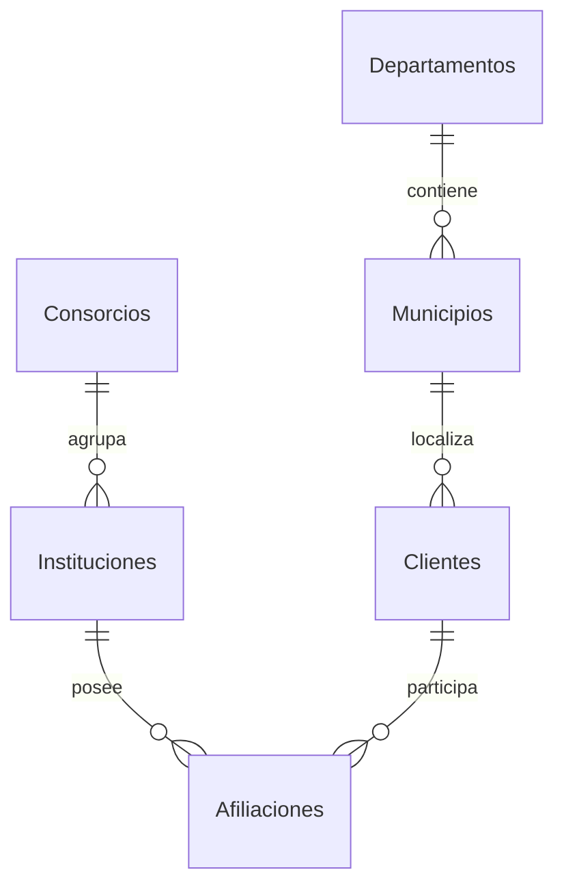

# Arquitectura, base de datos e índices

## Requisitos y alcance

El documento de origen exige consorcios con ID y nombre; instituciones con ID, nombre, tipo y fecha de fundación; clientes con ID, DUI, nombre, nacimiento, género y dirección. Una institución pertenece a un consorcio y un cliente puede afiliarse a varias instituciones. La entrega implementa estas reglas, formularios, persistencia y presentación de 18 diapositivas.

Las indicaciones de trabajar en pareja, designar coordinador y exponer corresponden al equipo académico. No se sustituyen con la aplicación. La fecha mencionada en el PDF no especifica año. Las cuentas, roles, auditoría, exportación, búsqueda y control de concurrencia son ampliaciones para facilitar la operación.

## Separación de responsabilidades

| Clase / archivo | Responsabilidad |
|---|---|
| Program | Inicio, configuración y ciclo de sesión |
| LoginForm | Captura de credenciales y mensajes de acceso |
| MainForm | Navegación, resumen, listados y exportación |
| EditorForm | Construcción de formularios, errores por campo y consulta de fichas |
| AffiliationsForm | Cartera de un cliente y selección de instituciones |
| Theme | Estilo visual, botones y manejo de errores esperados |
| Service | Validaciones, roles, transacciones y reglas de negocio |
| Database | Apertura y cierre de conexiones, consultas parametrizadas |
| Session | Datos de identidad y rol en un objeto inmutable |
| IntegrationTests | Casos de integración contra SQL Server |

El diseño aplica encapsulación y composición. Los formularios heredan de `Form`; los controles reutilizan funciones de Theme. No se fuerza una jerarquía de clases Banco/Cooperativa, porque el enunciado solo diferencia el tipo y no comportamientos. Las clases de negocio reciben Database como dependencia. El proyecto usa ADO.NET con Microsoft.Data.SqlClient.

## Modelo relacional

`Afiliaciones` resuelve la relación muchos a muchos. Su clave primaria compuesta impide repetir la misma pareja. No limita a un cliente a un consorcio: puede tener instituciones de consorcios distintos.

Cada entidad tiene clave primaria. La dirección guarda MunicipioId y complemento. El departamento se obtiene desde Municipios y no se repite en Clientes. Esto evita inconsistencias y mantiene la información descriptiva en su propia entidad, siguiendo tercera forma normal para los datos de negocio.

## Diccionario

| Tabla | Campos principales | Relaciones y propósito |
|---|---|---|
| Consorcios | Id int identity, Nombre nvarchar(100), Version rowversion | Nombre único |
| Instituciones | Id, ConsorcioId, Nombre nvarchar(100), Tipo nvarchar(15), Fundacion date, Version | FK a Consorcios obligatoria |
| Departamentos | Id, Nombre nvarchar(60) | Catálogo territorial |
| Municipios | Id, DepartamentoId, Nombre nvarchar(80) | FK a Departamentos; nombre único por departamento |
| Clientes | Id, DUI varchar(10), Nombre nvarchar(120), Nacimiento date, Genero nvarchar(25), MunicipioId, Complemento nvarchar(250), Version | DUI único, FK a Municipios |
| Afiliaciones | ClienteId, InstitucionId, Fecha datetime2 | PK compuesta y dos FK |
| Usuarios | Id, Nombre nvarchar(40), ClaveHash varbinary(32), Salt varbinary(16), Rol nvarchar(20), Version | Acceso de aplicación |
| Auditoria | Id bigint identity, Fecha datetime2, Usuario nvarchar(40), Accion, Entidad, RegistroId | Registro transaccional, fechas UTC |

Auditoria conserva el nombre de usuario al momento de la acción, incluso si después se cambia o elimina la cuenta. No tiene FK al registro editado para poder conservar eliminaciones.

## Validaciones

| Regla | Formulario / servicio | SQL Server |
|---|---|---|
| Campos requeridos | Marcación y mensaje en español | NOT NULL y CHECK de longitudes principales |
| DUI | Expresión de ocho dígitos, guion y un dígito | CHECK con collation binaria y UNIQUE |
| Fechas | Selector, confirmación, límites y comprobación | date y CHECK contra fecha actual |
| Fundación | Desde 1753 hasta hoy | Mismo intervalo |
| Nacimiento | Desde 1900 hasta hoy | Mismo intervalo |
| Tipo y género | Catálogos cerrados | CHECK |
| Institución con un consorcio | Selección obligatoria | Una FK no nula |
| Municipio compatible | Lista dependiente del departamento | Cliente solo guarda FK a municipio |
| Afiliación duplicada | Lista excluye afiliaciones existentes | PK compuesta |
| Borrado con relaciones | Mensaje, confirmación y rol administrador | FK sin eliminación en cascada |
| Edición simultánea | Ficha conserva Version al abrir | UPDATE condicionado por rowversion |

Las fechas usan el reloj local del cliente para validación y el reloj del servidor para restricciones. Mantener ambos sincronizados evita discrepancias cerca del cambio de día. No se verifica el dígito oficial ni existencia real del DUI. No se impone mayoría de edad.

## Transacciones y concurrencia

Cada escritura y su auditoría se ejecutan en la misma conexión y transacción. Si una falla, no se confirma ninguna. Las conexiones se liberan con `using`; SqlClient puede reutilizarlas mediante su pool.

La ficha envía el `rowversion` que leyó al abrirse. Si otro usuario modificó el registro, el UPDATE no coincide y el sistema rechaza el guardado. Se debe cerrar y abrir la ficha para revisar la nueva versión. No existe combinación automática de cambios. Las restricciones UNIQUE y FK resuelven carreras por duplicados y borrados dependientes.

## Índices y consulta que atienden

| Índice | Consulta prevista | Motivo |
|---|---|---|
| PK de cada entidad | Búsqueda y actualización por ID | Acceso directo y unicidad |
| UNIQUE Clientes.DUI | Identificar cliente y evitar duplicados | Clave natural alternativa |
| IX_Clientes_Nombre (Nombre, Id) INCLUDE (DUI, MunicipioId) | Búsqueda por prefijo y orden de clientes | Orden estable para paginación |
| IX_Clientes_Municipio | Clientes por localidad y validación referencial | Acceso por FK |
| IX_Instituciones_Consorcio INCLUDE (Nombre, Tipo) | Instituciones de un consorcio | Reduce búsquedas adicionales |
| PK_Afiliaciones (ClienteId, InstitucionId) | Instituciones de un cliente | Orden de columnas por flujo de ficha |
| IX_Afiliaciones_Institucion (InstitucionId, ClienteId) | Cartera de una institución | Permite recorrer la relación en sentido inverso |
| UNIQUE Municipios (DepartamentoId, Nombre) | Catálogo dependiente de departamento | Evita duplicación en el catálogo |
| IX_Auditoria_Fecha DESC | Historial reciente | Apoya orden cronológico |

`03_Consultas_y_Indices.sql` contiene ejemplos, inventario y una consulta opcional a estadísticas de uso. Un índice disponible no garantiza que el optimizador lo elija. Medir con el plan real y STATISTICS IO antes de añadir más. Los índices tienen costo de almacenamiento y escritura.

Los listados usan OFFSET/FETCH con 50 filas y orden estable. Búsqueda por prefijo evita el comodín inicial. Para millones de registros y páginas profundas, sustituir OFFSET por paginación por clave y revisar el predicado OR de nombre/DUI.

## Catálogo territorial y datos ficticios

El catálogo distingue municipios de distritos e incluye 14 departamentos y 44 municipios. Referencia consultada: [Asamblea Legislativa, distribución territorial](https://asamblea.gob.sv/node/12806), y [aprobación de la reestructuración](https://www.asamblea.gob.sv/node/12819). El proyecto no necesita almacenar distritos y no los incluye. Los nombres de personas, instituciones, direcciones y DUI de la carga son sintéticos y no constituyen un padrón real.

## Escalabilidad y límites verificados

Se verificaron compilación y operaciones de integración con SQL Server Express local y 1,200 clientes. Esta muestra no es un ensayo de carga empresarial. La estructura soporta conexiones de varios clientes, con transacciones y control optimista de ediciones, pero se debe medir el número de usuarios y volumen reales.

La interfaz usa operaciones síncronas: una conexión lenta puede pausar la ventana hasta el tiempo de espera. Para red de mayor latencia, convertir la capa de datos a métodos async y agregar cancelación e indicadores de carga. Las tablas conservan índices y claves adecuadas como punto de partida.

Los roles se aplican en el servicio C#, no en identidades independientes de SQL Server. Quien tenga permisos directos en SSMS puede eludir los roles y la auditoría de aplicación. Para producción, interponer una API con identidad centralizada o procedimientos almacenados y permisos mínimos. No usar permisos de administrador de SQL para usuarios finales.

También se requieren certificados válidos, eliminación de credenciales de demostración, políticas de contraseñas y bloqueo centralizado, pruebas de restauración, monitoreo de consultas y pruebas de carga. No se incluyen disponibilidad alta, cifrado adicional de campos, segregación por institución ni recuperación automática. Los roles ven todos los consorcios porque el PDF no pide aislamiento por institución.
